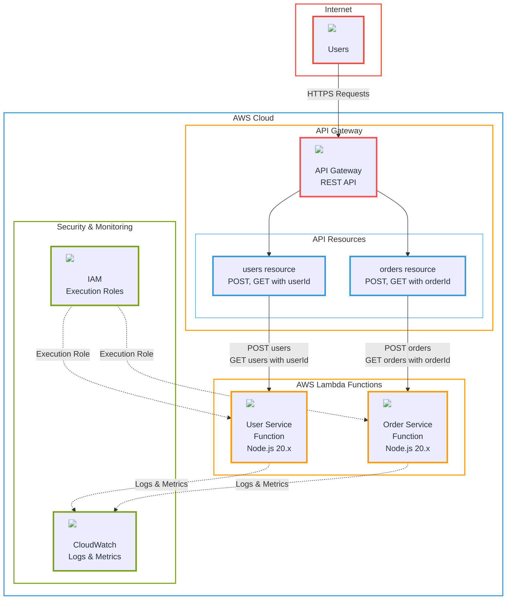

# Better Lambda - Production-Ready CDK Project

This project demonstrates a production-ready AWS CDK setup using the **pre-built deployment package approach** for Lambda functions.

## Project Structure

```
better-lambda/
├── bin/                           # CDK app entry point
├── lib/                           # CDK stack definitions
├── test/                          # CDK tests
├── lambda-functions/              # Lambda function source code
│   ├── user-service/
│   │   ├── src/
│   │   │   ├── index.ts          # Lambda handler
│   │   │   └── handlers/         # Business logic
│   │   ├── package.json
│   │   └── tsconfig.json
│   └── order-service/
│       ├── src/
│       ├── package.json
│       └── tsconfig.json
├── shared/                        # Shared utilities and types
│   ├── types/
│   └── utils/
├── deployments/                   # Build artifacts and scripts
│   ├── artifacts/                # Built Lambda .zip files
│   └── build-scripts/            # Build automation
├── .github/workflows/            # CI/CD pipelines
└── package.json                  # Root workspace configuration
```

## Getting Started

### 1. Bootstrap the Project

```bash
npm run bootstrap
```

### 2. Build Lambda Functions

```bash
npm run build-lambdas
```

### 3. Deploy Infrastructure

```bash
npm run deploy
```

## Local Development

For local development and testing, see [LOCAL_DEVELOPMENT.md](LOCAL_DEVELOPMENT.md).

## Development Workflow

### Building Individual Lambda Functions

```bash
# User service
cd lambda-functions/user-service
npm run build
npm run package

# Order service
cd lambda-functions/order-service
npm run build
npm run package
```

### CDK Commands

```bash
# Synthesize CloudFormation template
npm run cdk synth

# Deploy stack
npm run cdk deploy

# Destroy stack
npm run cdk destroy
```

## CI/CD Pipeline

The project includes GitHub Actions workflows that:

1. **Build Phase**: Compiles and packages all Lambda functions
2. **Deploy Phase**: Deploys infrastructure using CDK (main branch only)

### Required Secrets

- `AWS_ACCESS_KEY_ID`
- `AWS_SECRET_ACCESS_KEY`

## Architecture

Diagram (static)


Diagram (mermaid)



## Architecture Benefits

- ✅ **Separation of Concerns**: Infrastructure and application code are clearly separated
- ✅ **Consistent Deployments**: Same artifacts deployed across environments
- ✅ **Fast Deployments**: No build time during CDK deployment
- ✅ **Version Control**: Artifacts can be versioned and rolled back
- ✅ **Team Scalability**: Infrastructure and application teams can work independently

## Lambda Functions

### User Service

- **POST** `/users` - Create a new user
- **GET** `/users/{userId}` - Get user by ID

### Order Service

- **POST** `/orders` - Create a new order
- **GET** `/orders/{orderId}` - Get order by ID

Both services return JSON responses and include proper error handling.
