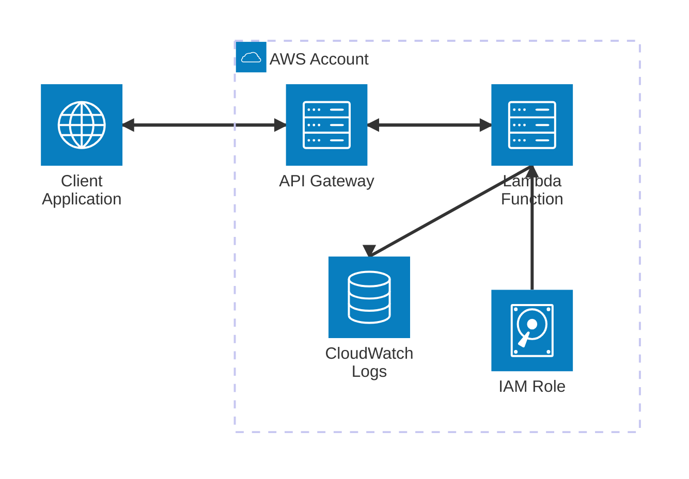

# Simple Lambda Weather API - CDK TypeScript Project

A serverless weather API built with AWS CDK, Lambda, and API Gateway following AWS best practices and standard architecture patterns.

## 🏗️ Architecture Overview

This project implements a simple serverless API that accepts city names and returns mock weather data. The architecture follows AWS Well-Architected principles with proper separation of concerns.

### AWS Architecture Diagram

The following diagram illustrates the serverless architecture pattern using AWS standard components:



### Architecture Highlights

- **Serverless Pattern**: No server management, automatic scaling
- **Event-Driven**: API Gateway triggers Lambda on HTTP requests
- **Type Safety**: Full TypeScript implementation with AWS Lambda types
- **CORS Support**: Enables cross-origin requests for web applications
- **Error Handling**: Comprehensive error responses with proper HTTP status codes
- **Observability**: CloudWatch Logs for monitoring and debugging
- **Infrastructure as Code**: CDK for reproducible deployments

## 📁 Project Structure

```
simple-lambda/
├── src/                              # Lambda source code
│   └── weather-handler/              # Weather Lambda function
│       ├── index.ts                  # TypeScript handler implementation
│       ├── index.js                  # Compiled JavaScript (auto-generated)
│       └── test-event.json          # Test event for local testing
├── lib/                              # CDK infrastructure code
│   └── simple-lambda-stack.ts       # Lambda + API Gateway stack definition
├── bin/                              # CDK app entry point
│   └── simple-lambda.ts             # CDK app configuration
├── test/                             # CDK unit tests
│   └── simple-lambda.test.ts        # Stack tests
├── cdk.out/                          # CDK synthesized templates (auto-generated)
└── package.json                      # Dependencies including @types/aws-lambda
```

## 🔧 Built With

- **AWS CDK v2** - Infrastructure as Code
- **TypeScript** - Lambda function and CDK code
- **AWS Lambda** - Serverless compute (Node.js 18.x)
- **API Gateway** - REST API with CORS support
- **SAM CLI** - Local testing and development

## ⚡ API Endpoints

### GET /weather
Query weather by city name using query parameters.

**Request:**
```bash
GET /weather?city=London
```

**Response:**
```json
{
  "message": "Weather data for London",
  "data": {
    "city": "London",
    "temperature": 22,
    "condition": "Sunny",
    "timestamp": "2025-07-20T13:58:42.659Z"
  }
}
```

### POST /weather
Query weather by city name using request body.

**Request:**
```bash
POST /weather
Content-Type: application/json

{
  "city": "Paris"
}
```

**Response:**
```json
{
  "message": "Weather data for Paris",
  "data": {
    "city": "Paris",
    "temperature": 27,
    "condition": "Sunny",
    "timestamp": "2025-07-20T13:58:48.683Z"
  }
}
```

## 🚀 Local Development & Testing

### Prerequisites
- Node.js 18.x or later
- AWS CDK CLI (`npm install -g aws-cdk`)
- SAM CLI ([Installation Guide](https://docs.aws.amazon.com/serverless-application-model/latest/developerguide/install-sam-cli.html))

### Setup
```bash
# Install dependencies
npm install

# Install Lambda TypeScript types
npm install --save-dev @types/aws-lambda
```

### Compile TypeScript to JavaScript
```bash
# Compile the Lambda handler
cd src/weather-handler
npx tsc index.ts --target ES2022 --module CommonJS --esModuleInterop
cd ../..
```

### Generate CDK Templates
```bash
# Synthesize CloudFormation templates
cdk synth
```

### Local Testing with SAM

#### 1. Start Local API Gateway
```bash
# Start SAM local API on port 3001
sam local start-api --template cdk.out/SimpleLambdaStack.template.json --port 3001
```

#### 2. Test GET Endpoint
```bash
# Test with query parameter
curl "http://localhost:3001/weather?city=Tokyo"
```

#### 3. Test POST Endpoint
```bash
# Test with request body
curl -X POST "http://localhost:3001/weather" \
  -H "Content-Type: application/json" \
  -d '{"city": "Paris"}'
```

#### 4. Direct Lambda Invocation
```bash
# Test Lambda function directly with test event
sam local invoke WeatherHandlerFC363847 \
  --template cdk.out/SimpleLambdaStack.template.json \
  --event src/weather-handler/test-event.json
```

### Useful CDK Commands

* `npm run build`   - Compile TypeScript to JavaScript
* `npm run watch`   - Watch for changes and compile
* `npm run test`    - Run Jest unit tests
* `cdk deploy`      - Deploy stack to your default AWS account/region
* `cdk diff`        - Compare deployed stack with current state
* `cdk synth`       - Generate CloudFormation templates
* `cdk destroy`     - Remove the deployed stack

## 🎯 Next Steps

1. **Weather API Integration**: Replace mock data with real weather API (OpenWeatherMap, AccuWeather, etc.)
2. **Environment Variables**: Add API keys and configuration via CDK
3. **Error Handling**: Enhance error responses and validation
4. **Monitoring**: Add CloudWatch dashboards and alarms
5. **Authentication**: Implement API Gateway authentication if needed
6. **Testing**: Add comprehensive unit and integration tests

## 📊 Performance Insights

Based on local testing:
- **Cold Start**: ~650-700ms (first invocation)
- **Warm Start**: <100ms (subsequent invocations)
- **Memory Usage**: ~256 MB (configured)
- **Timeout**: 30 seconds (configured)

## 🔐 Security Features

- **CORS**: Enabled for cross-origin requests
- **Input Validation**: City parameter validation
- **Error Handling**: Secure error responses without sensitive data exposure
- **IAM**: Minimal required permissions via CDK-generated roles

---

Built with ❤️ using AWS CDK and TypeScript
