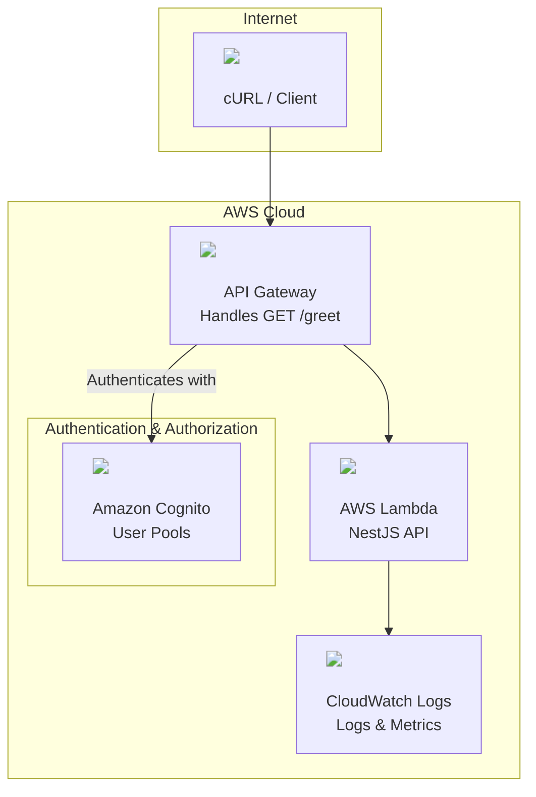

# Serverless Authentication API with AWS CDK

This project demonstrates a complete serverless authentication architecture using AWS CDK, featuring a NestJS-inspired Lambda API with Cognito authentication.

## 🏗️ Architecture Overview

This implementation showcases modern serverless patterns with:

- **AWS Lambda** running a NestJS-style API
- **API Gateway** with CORS and authentication
- **Amazon Cognito User Pools** for user management and JWT authentication
- **CloudWatch** for logging and monitoring
- **Infrastructure as Code** using AWS CDK

## ✨ Features

- 🔐 **JWT Authentication** - Secure user authentication with Cognito
- 🚀 **Serverless** - No server management, automatic scaling
- 🌐 **CORS Enabled** - Ready for frontend integration
- 📊 **Monitoring** - CloudWatch logs and metrics
- 🔧 **Infrastructure as Code** - Reproducible deployments
- 🧪 **Testing Ready** - Includes test user creation commands

## 🚀 Quick Start

### Prerequisites

- AWS CLI configured with your credentials
- AWS CDK installed (`npm install -g aws-cdk`)
- Node.js 18+ and npm

### 1. Deploy the Infrastructure

```bash
# Install dependencies
npm install

# Build the project
npm run build

# Deploy to AWS (replace 'dev' with your AWS profile)
npx cdk deploy --profile dev
```

### 2. Create a Test User

After deployment, use the output commands to create a test user:

```bash
# Create user (use the CreateTestUserCommand from CDK output)
aws cognito-idp admin-create-user --user-pool-id <USER_POOL_ID> --username testuser --user-attributes Name=email,Value=test@example.com Name=email_verified,Value=true --temporary-password TempPass123! --message-action SUPPRESS --profile dev

# Set permanent password (use the SetUserPasswordCommand from CDK output)
aws cognito-idp admin-set-user-password --user-pool-id <USER_POOL_ID> --username testuser --password TestPass123! --permanent --profile dev
```

### 3. Test the API

```bash
# Test public endpoint (no auth required)
curl -X GET <HEALTH_ENDPOINT>

# Authenticate and get token (use the AuthenticateCommand from CDK output)
aws cognito-idp admin-initiate-auth --user-pool-id <USER_POOL_ID> --client-id <CLIENT_ID> --auth-flow ADMIN_NO_SRP_AUTH --auth-parameters USERNAME=testuser,PASSWORD=TestPass123! --profile dev

# Test protected endpoint (requires authentication)
curl -X GET <GREET_ENDPOINT> -H "Authorization: Bearer <ID_TOKEN>"
```

## 🔧 Development Commands

- `npm run build` - Compile TypeScript to JavaScript
- `npm run watch` - Watch for changes and compile
- `npm run test` - Run Jest unit tests
- `npx cdk deploy --profile dev` - Deploy to your AWS account
- `npx cdk diff --profile dev` - Compare deployed stack with current state
- `npx cdk synth` - Emit the synthesized CloudFormation template
- `npx cdk destroy --profile dev` - Remove all resources from AWS

## Architecture Diagram



## 📋 API Endpoints

### Public Endpoints

- `GET /health` - Health check endpoint (no authentication required)

### Protected Endpoints

- `GET /greet` - Personalized greeting (requires Cognito JWT authentication)

## 🔐 Authentication Flow

1. **User Creation**: Create users in Cognito User Pool
2. **Authentication**: Users authenticate with username/password
3. **Token Generation**: Cognito returns JWT tokens (Access, ID, Refresh)
4. **API Authorization**: API Gateway validates JWT with Cognito
5. **Lambda Execution**: Authenticated requests reach Lambda with user context

## 🏗️ Infrastructure Components

| Component             | Purpose                            | Configuration                            |
| --------------------- | ---------------------------------- | ---------------------------------------- |
| **Cognito User Pool** | User management and authentication | Email/username login, email verification |
| **API Gateway**       | HTTP API with authentication       | CORS enabled, Cognito authorizer         |
| **Lambda Function**   | Application logic                  | Node.js 20.x, 256MB memory, 30s timeout  |
| **CloudWatch**        | Logging and monitoring             | 1-week log retention                     |

## 📝 Environment Variables

The Lambda function has access to:

- `USER_POOL_ID` - Cognito User Pool ID
- `USER_POOL_CLIENT_ID` - Cognito User Pool Client ID

## 🧪 Testing Examples

### Successful Authentication Response

```json
{
  "message": "Hello testuser! Welcome to the NestJS API on AWS Lambda.",
  "timestamp": "2025-06-25T23:29:14.140Z",
  "requestId": "6ffeaccb-5329-42fb-a7bd-17d829e6ab99"
}
```

### Unauthorized Access Response

```json
{
  "message": "Unauthorized"
}
```

## 🔧 Customization

### Adding New Endpoints

1. Add new resources in `simple-lambda-stack.ts`
2. Update Lambda function code
3. Configure appropriate authentication

### Modifying Authentication

- Update Cognito User Pool settings
- Modify password policies
- Configure additional auth flows

## 📚 CDK Stack Outputs

After deployment, the stack provides:

- **API endpoints** for testing
- **User Pool IDs** for user management
- **Ready-to-use CLI commands** for:
  - Creating test users
  - Setting passwords
  - Authentication

## 🗑️ Cleanup

To remove all AWS resources:

```bash
npx cdk destroy --profile dev
```

**Note**: This will delete all users, data, and resources created by this stack.

## 📖 Learning Resources

- [AWS CDK Documentation](https://docs.aws.amazon.com/cdk/)
- [Amazon Cognito User Pools](https://docs.aws.amazon.com/cognito/latest/developerguide/cognito-user-identity-pools.html)
- [AWS Lambda with Node.js](https://docs.aws.amazon.com/lambda/latest/dg/lambda-nodejs.html)
- [API Gateway with Cognito](https://docs.aws.amazon.com/apigateway/latest/developerguide/apigateway-integrate-with-cognito.html)
